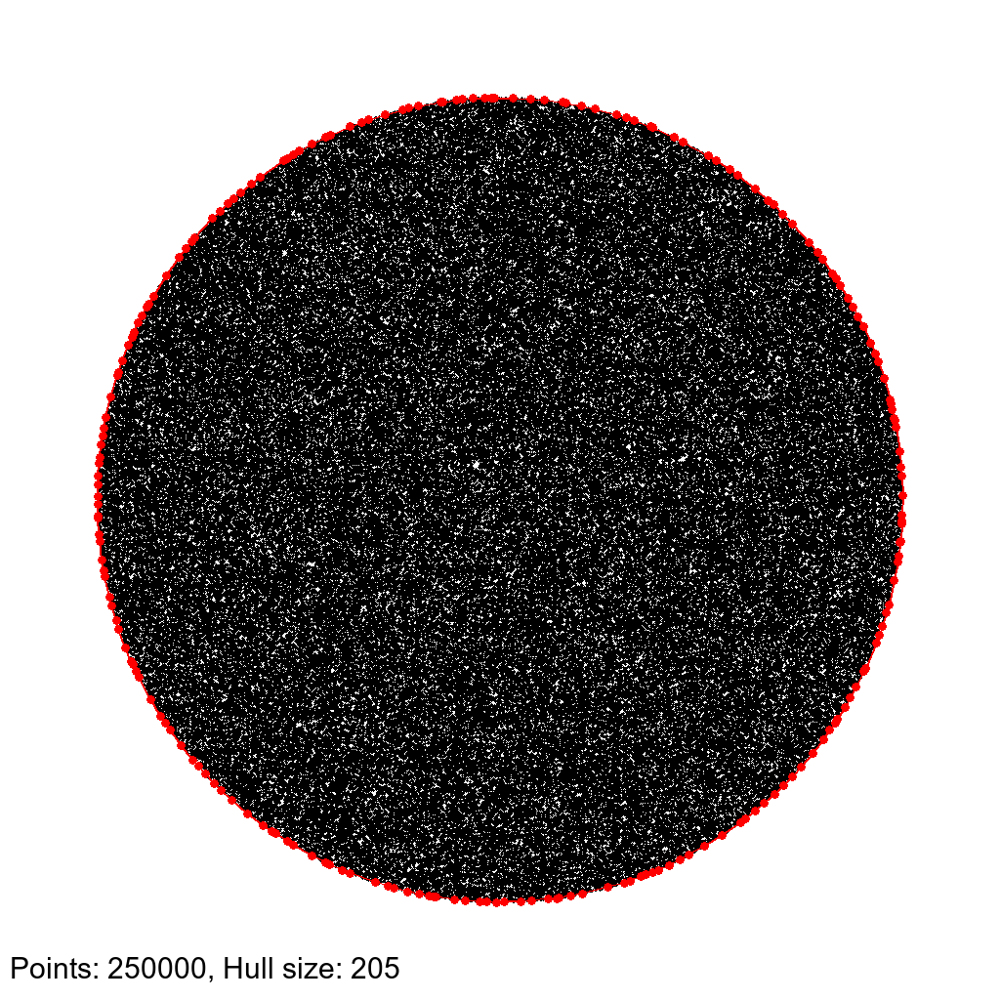
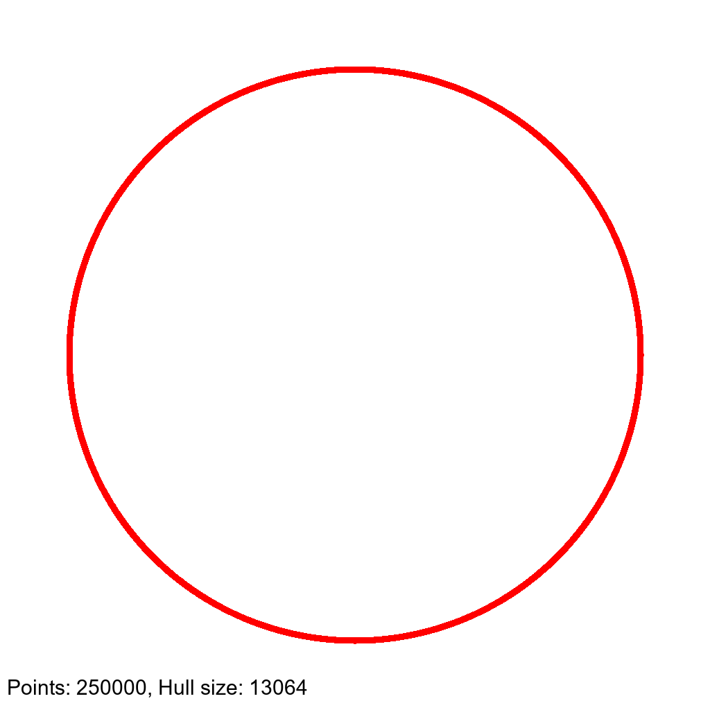
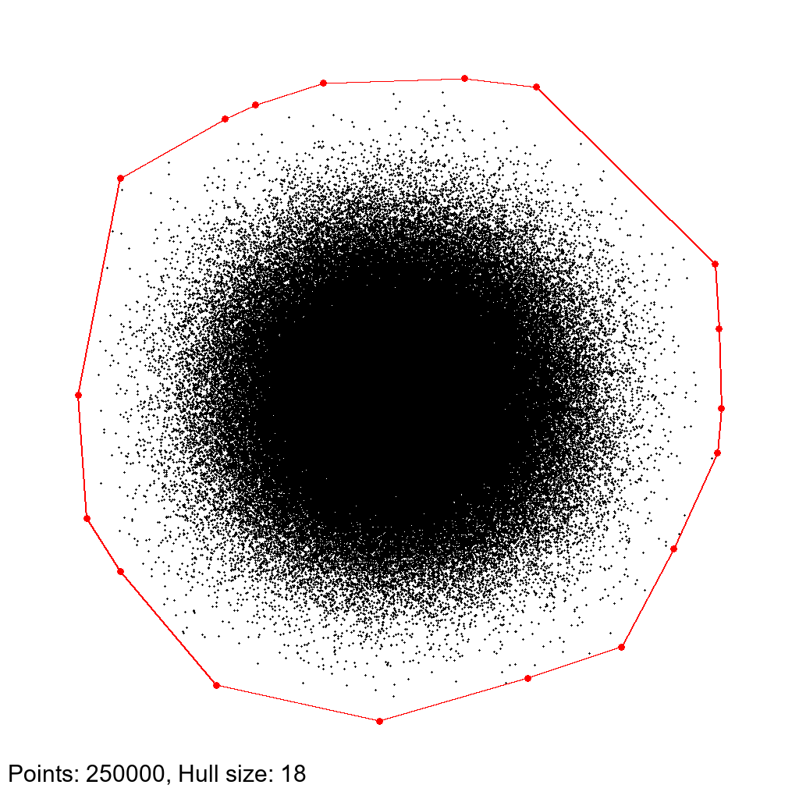
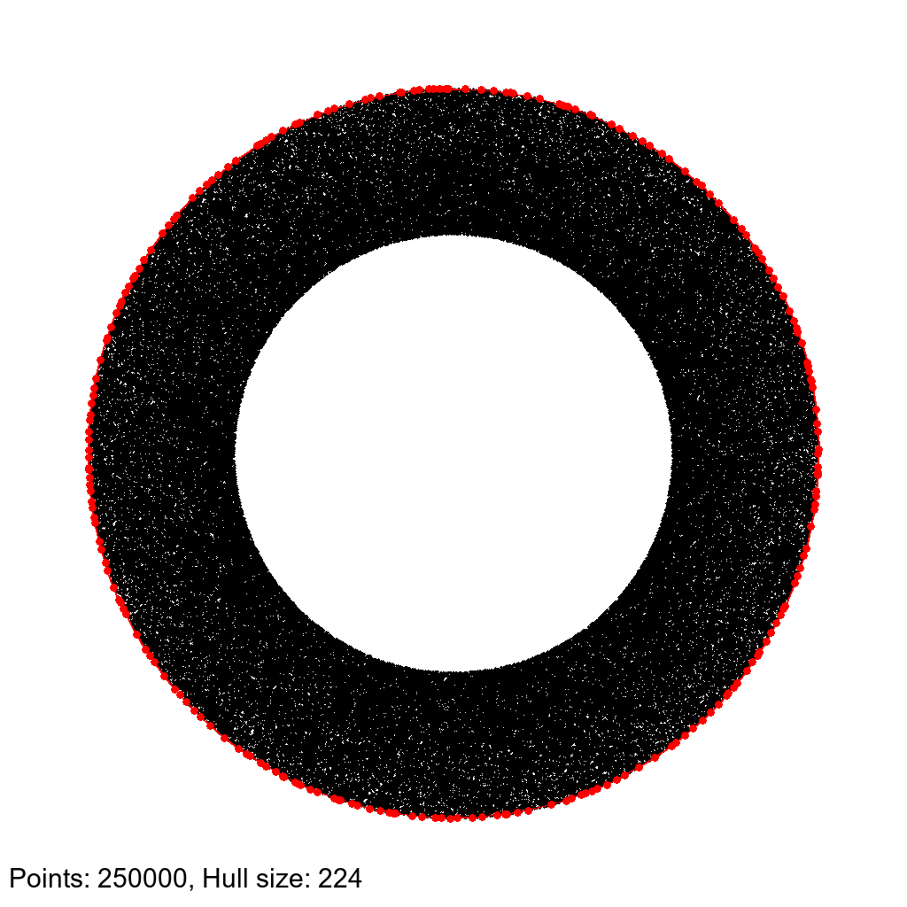

# How to run the code
### to generate random points:
- `g++ randompoints.cpp -o build/randompoints -O3` (compile only once)
- `./build/randompoints [#points=100]` \
or
- `g++ randompoints.cpp -o build/randompoints -O3 && ./build/randompoints [#points=100]`

### to run the algorithm:
- `mpicxx QuickHullMPI.cxx -o build/QuickHullMPI -O3` (compile only once)
- `mpirun -n 4 ./build/QuickHullMPI` \
or
- `make && mpirun -n 4 ./build/QuickHullMPI 100000000`
- `make && ./build/QuickHullSeq 100000000`

# Format for the input file (points.bin)
- 4 bytes: #bytes for the number of points (n)
- 4 bytes: #bytes for each point (d)
- n bytes (size_t): number of points
- n*d bytes (long+long): points

# Some "small" examples of convex hulls with different point distributions

## Circle distribution (used for testing):

## Circumference distribution:

## Gaussian distribution:

## Toroid distribution:
